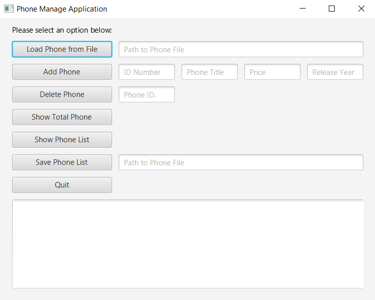

# Final Project

**Title:** Phone Application Manager 
**Name:** Arjmand Masood 
**Student ID:** G00388364 

## Application Function
* I use javaFX GUI for my project. 
* My project Load DB, Add Phone, Delete Phone, Find Phone by ID, Show total Phone, Save to DB and Quit.

## Running the Application

1. Download the ZIP file from GitHub. 
2. Import the project in the eclipse. 
3. Go to ooc2-final-project-2021-arjmandmasood > src > ie.gmit.mypackage  
4. Then double click on Main.java  
5. Click on run (A JavaFX layout will open)  
6. It has title at the top "Phone manage application"  
7. On the left side of the gridePane, I added 7 buttons and set their same width.  
8. On the right hand side of the gridPane, I added text Field for get the text from user  
9. Click on "show total phone" button (In the text field at the bottom shows a message "Current Total Phone: 0")  
10. In the first text field enter the phone.csv file path (right now the path is "C:\Users\xman\eclipse-workspace\ooc2-final-project-2021-arjmandmasood\resources\phone.csv").
11. Click on "Load Phone FRom File" button.
12. The massage shows at the bottom text field "DB loaded successfully from C:\Users\xman\eclipse-workspace\ooc2-final-project-2021-arjmandmasood\resources\phone.csv".
13. Click on "show phone list" button  
14. The phone list shows at the bottom text field.  
15. Click on "show total phone" button (In the text field at the bottom shows a message "Current Total Phone: 6")  
16. Click on "Add Phone" button  
17. For add the phone, enter the (ID: 0010, Phone Tile: iPhone, Price: 300, Release Year: 2019).
18. Click on "Add Phone" button  
19. All the text fields clear and the massage shows at the bottom text field "Phone has been Added phone list"  
20. Click on "show phone list" button  
21. The updated phone list shows at the bottom text field.  
22. Click on "show total phone" button (In the text field at the bottom shows a message "Current Total Phone: 7")  
23. For delete the phone from the list, write "Phone ID" in the text field  
24. Click on the "Delete Phone" button  
25. The massage shows at the bottom text field "Phone has been removed from the phone list!"  
26. Click on "show phone list" button  
27. The updated phone list shows at the bottom text field.  
28. Click on "show total phone" button (In the text field at the bottom shows a message "Current Total Phone: 6")  
29. For save phone list, give the file path in the text field and click on "Save Phone List" button 
30. The massage shows at the bottom text field "Phone list saved!"  
31. Click on "Quit" button to terminate the applicaton.  

## Minimum Project Requirments

Describe how I have met all minimum project requirements below:
* Everything about the project is on GitHub including code, documentaion and demo video.
* The project contain a working JavaFX GUI.
* The GUI has provide access to all 7 methods.
* I write all the methods = Load DB, Add Item, Delete Item, Find item by ID/Name, Show total items, Save to DB, Quit.
* My code clean and formatted in a standard way.
* I write comments with code. 

## Project Requirments above and beyond

Discuss any application features or design elements that show you went above and beyone basic requirments.

## Application Architecture
Discuss in detail how the application is structured. List all Classes. List their method and what they do. Discuss what structures are used to store data objects.
**Phone**
* This is the super class which have Phone product properties.
* This class have setter and getter method of instance variables.
* This class have Default Constructor
* It is a serialized class
* It has "findAllFieldValuesInCSVFormat" method 

**PhoneManage**
* This class is serialized class
* This class have Add, remove, count total, show all product, save into file, load from the file and quit method.
* This class have Defualt and parameterised Constructor
* In this class declare Array named "PhoneList"

**Main**  
*The main class have a main function which show the javaFX GUI.
*Have text fields and buttons.
*Call all the method when click the button 

Add a screenshot of the application architecture.

## JavaFX
Discuss the GUI design used. Discuss why you chose this design and any features you thing make your application stands out.

## Roadblocks and Unfinished Functionality
Discuss the issues you faced with creating your application. Provide possible solutions to these issues. What would you have done differently if you had to do this again? What did you not get finished?

## Resources
Provide links to resources used:

* [Tutorialspoint](https://www.tutorialspoint.com/java/) - Java Tutorials site I found helpful
